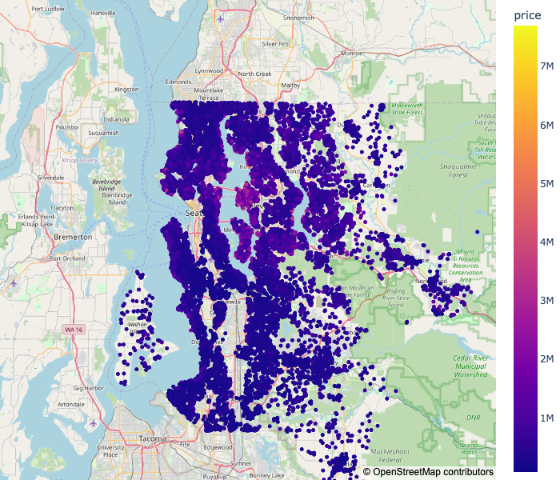
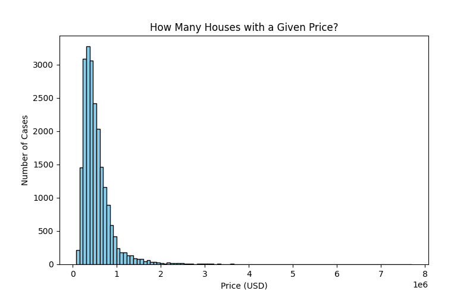
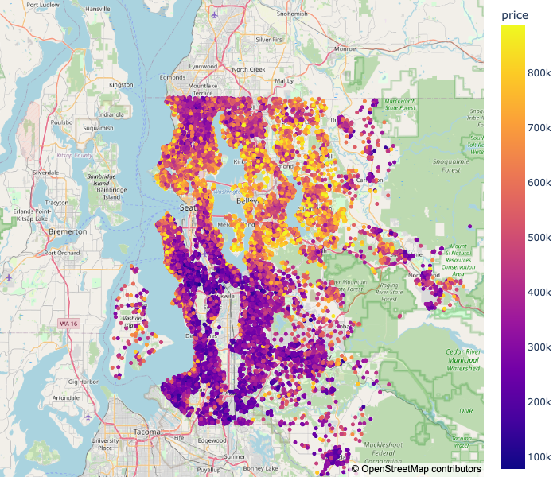
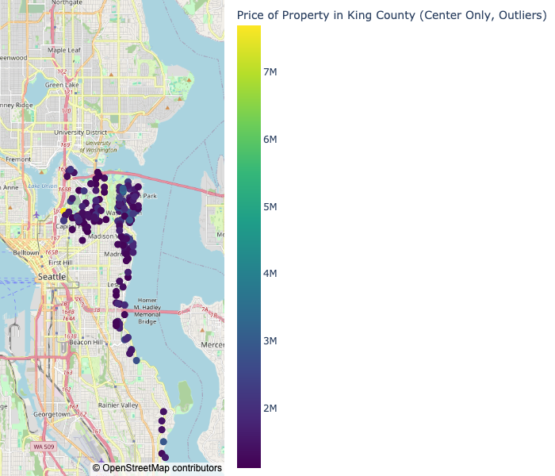
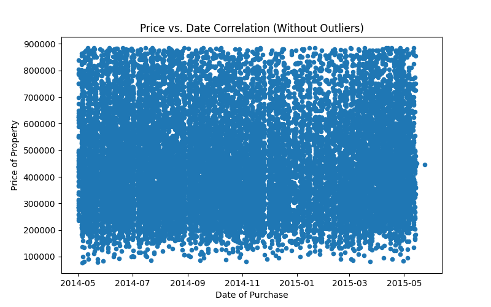
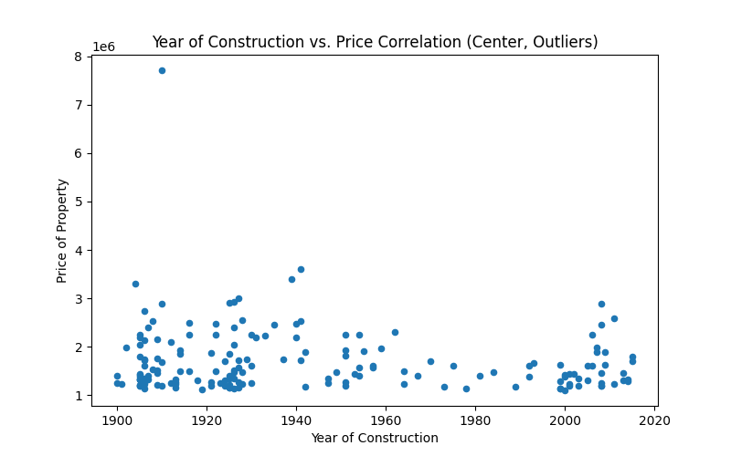

# EDA PROJECT PABLO 
## Assignment Prompt
_"Amy Williams (seller): Italian mafiosi, sells several central houses (top 10%) over time, needs average outskirt houses over time to hide from the FBI."_

## Assessing Client's Needs
Client interested in:
- **Selling expensive** property in the **center**.
- **Buying cheap** property **on the outskirts**.

**Price** is the only relevant variable,  since the houses will not be used for living.

## Defining Research questions
We have two different  domains of interest:
- Expensive houses in the center.
- Cheap houses on the outskirts.

We will be interested in variation of property price:
- Geographically
- Temporally

So that we can buy cheap and sell expensive.

## Analysis

This is the geographical distribution of property price across King County:

The plot suggests that property price is evenly distributed accross the county.

However, this conclusion is misleading. To seethat, consider the following histogram:

There are many more cheap than expensive houses, and the sheer predominant of cheap houses doesn't let us discern interesting geographical variations.

It is crucial to run different analysis for our two different domain areas, which are dictated by our customer's needs.

On the outskirts, we are not interested in outliers, since our customer wants to buy cheap. If we remove outliers (top 10%) from this area, we obtain:

In the city center, outliers are all we are interested in, since we want to sell at a high price. If we only keep outliers (top 10%) there, we get:

We see that there are interesting geographical variation obtains in both of our target domains, which could be used to buy cheap and sell expensive.

We can also examine the time evolution of these patterns by scatter-plotting the price in each domain against the following time-dependent variables:
- Year of purchase
- Year of construction:

Thus we obtain plots such as the following. This shows the price of property against the date of purchase for averagely-priced property on the outskirts:

And this shows how the price of property relates to the year of the property's construction, for expensive houses in the center: 

We thus see that the price of property does not depend significantly on time.

(Note that we have offered one plot per domain and variable for illustration purposes only. Two further plots are required to establish this conclusively).

(Note also that date of purchase time series is very limited, which invites caution with respect to our time dependence conclusions)

## Insights:
Geographic insights:
- Most expensive property in  Central Seattle is on West shore of Lake Washington.
- Cheapest property on outskirts is located in southern part of the county.

Temporal insights: prices mostly appear to be stable over  time (tentative).

## Recommendations:
- **No rush to sell or buy**, since price is appears constant over time.
- **Central property at waterfront**  should be sold at a **very high price** only (minimum $2M).
- **Apartment hunt** should focus on **south the county**.
- Property there should be bought at a low price (maximum $400k).
- **Further research recommended**, especially to clarify price dependence on time.
